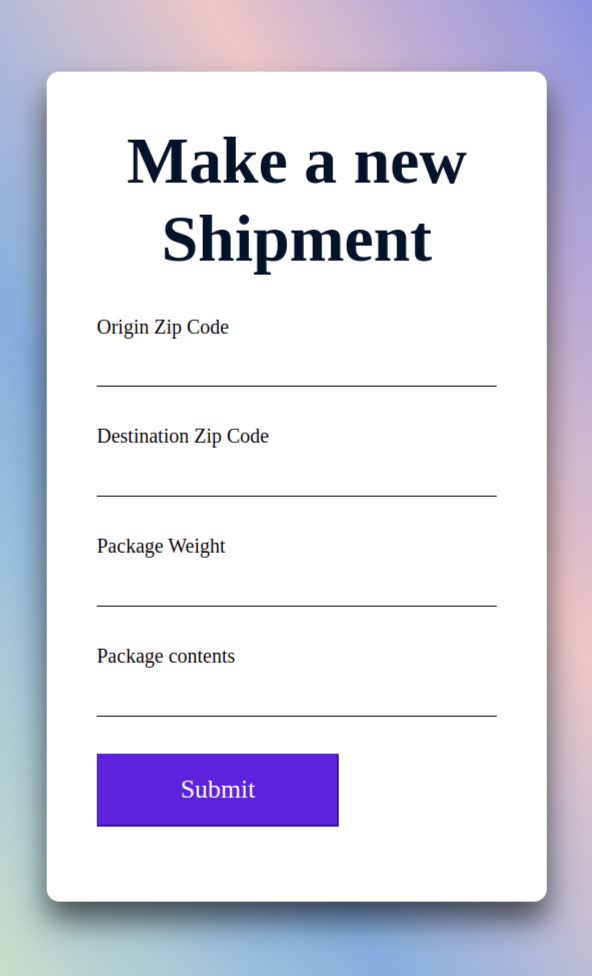
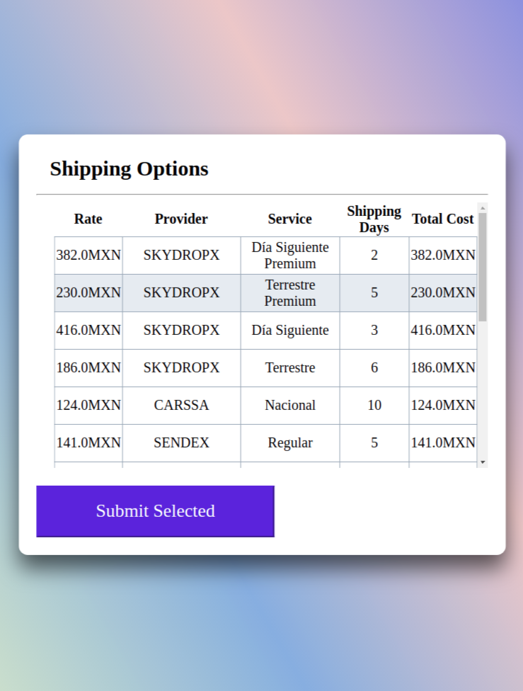

# React, SkydropX API Demo

A React coding challenge consuming some endpoints from the SkydropX API.
Making use of hooks, window.fetch and React Context in functional components.

See the docs [https://skydropx.github.io/api-doc/#skydropx-api]

## try it [https://loving-villani-135bf3.netlify.app]

#screenshot /*
#screenshot /*

## Available Scripts

In the project directory, you can run:

### `yarn start`

Runs the app in the development mode.\
Open [http://localhost:3000](http://localhost:3000) to view it in the browser.

The page will reload if you make edits.\
You will also see any lint errors in the console.

